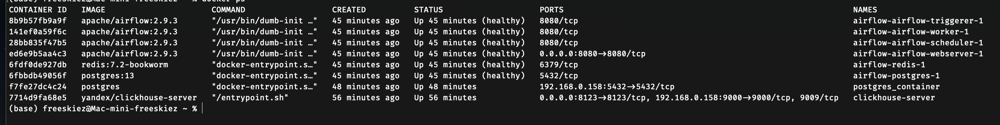
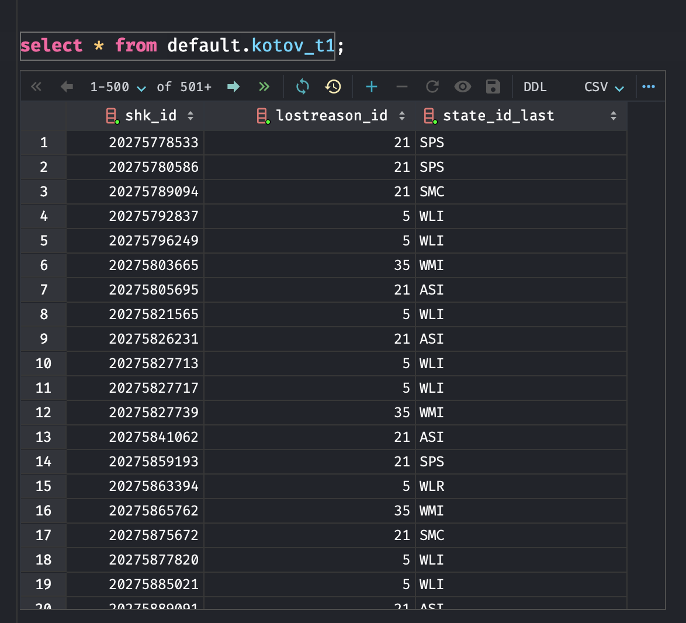
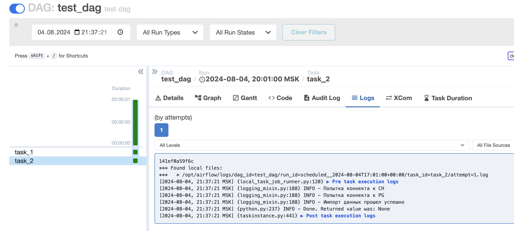
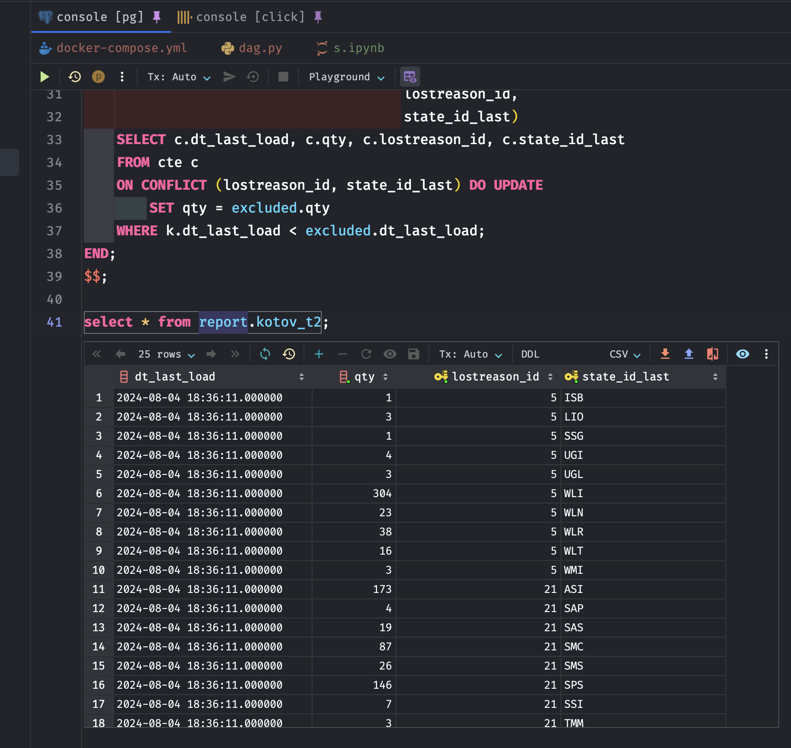

# ДЗ airflow

## 1 - Установить локально Airflow, ClickHouse, Postgres. Не забыть про то, что им нужно общаться  

## 2 - Создать таблицу в default схеме на локальном клике для последующей агрегации в report  

## 3 - Сделать даг, берущий данные из локального ClickHouse, а затем кладущий в витрину на том же клике и заинсертить их в Postgres через синк
Проверяем работоспособность дага в af 

 
Проверяем наличие данных в пг
 