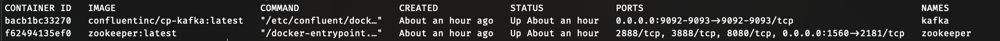
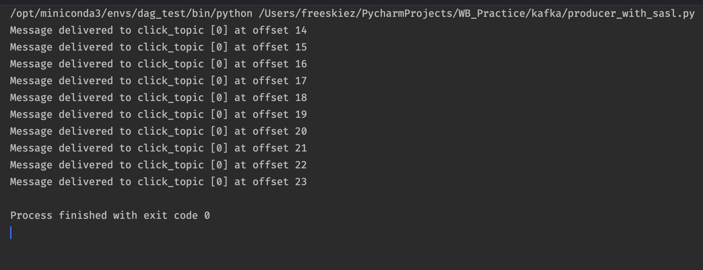
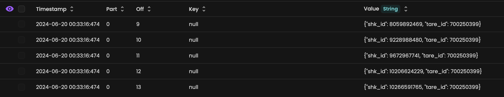
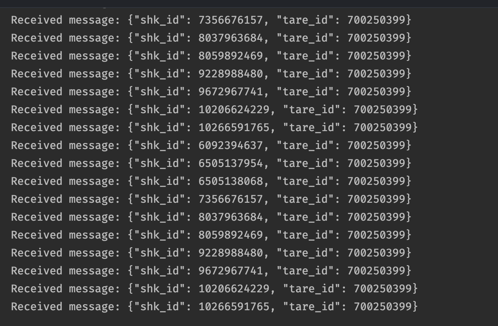

# Работа с kafka

## 1. Билд контейнера с kafka

[docker-compose-kafka-sasl.yml](./docker-compose-kafka-sasl.yml)

[client.properties](./client.properties)

[kafka_server_jaas.conf](./kafka_server_jaas.conf)

[zookeeper_jaas.conf](./zookeeper_jaas.conf)

## 2. Заливка данных из клика в топик кафки

[producer_with_sasl.py](./producer_with_sasl.py)

## 3. Проверка залитых данных

## 4. Чтение данных с кафки

[consumer_with_SASL.py](./consumer_with_SASL.py)
