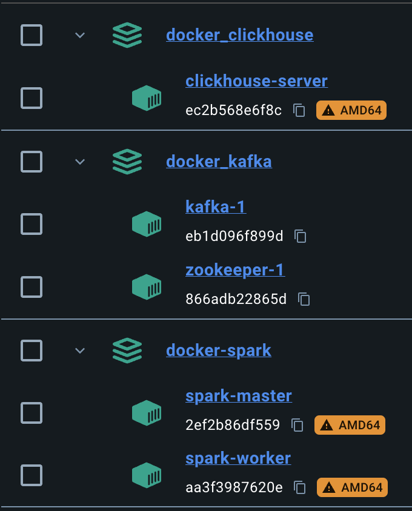
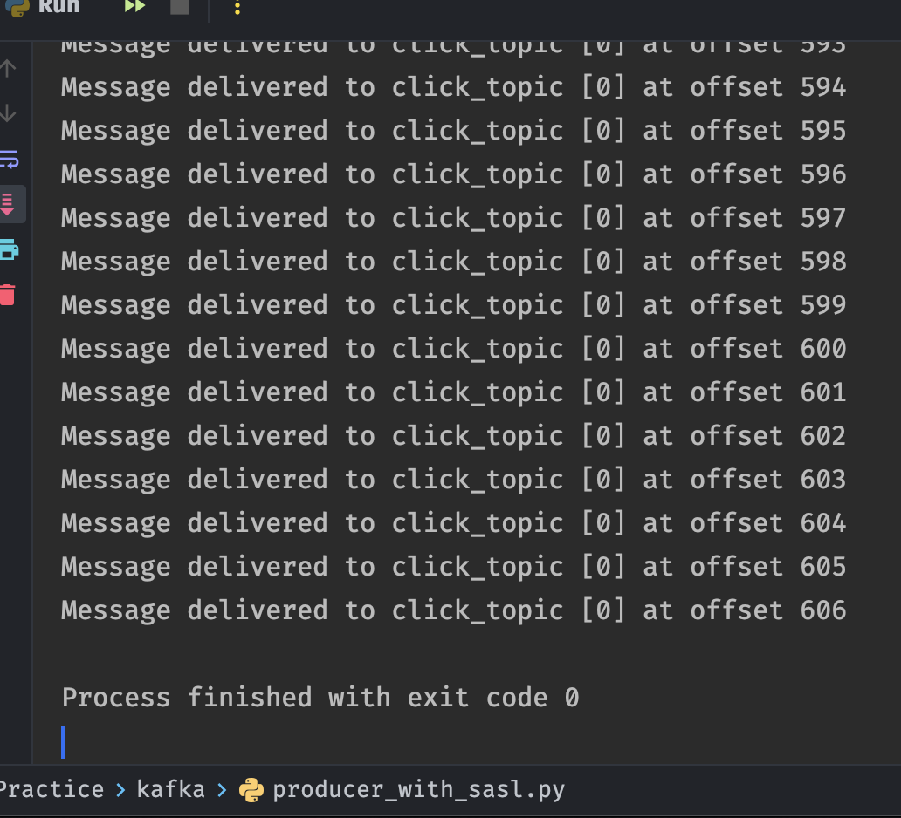
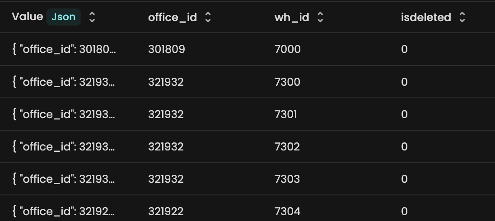
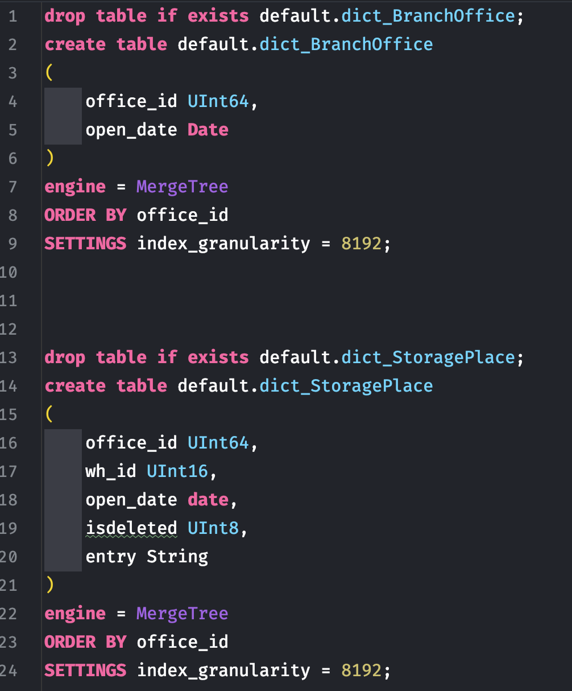
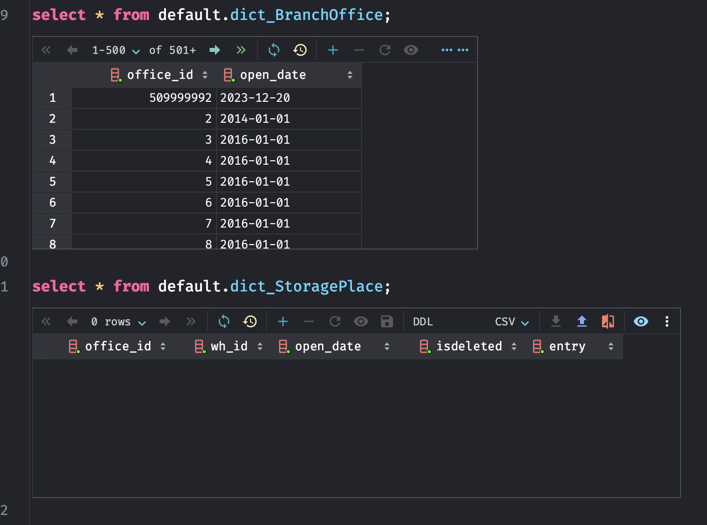
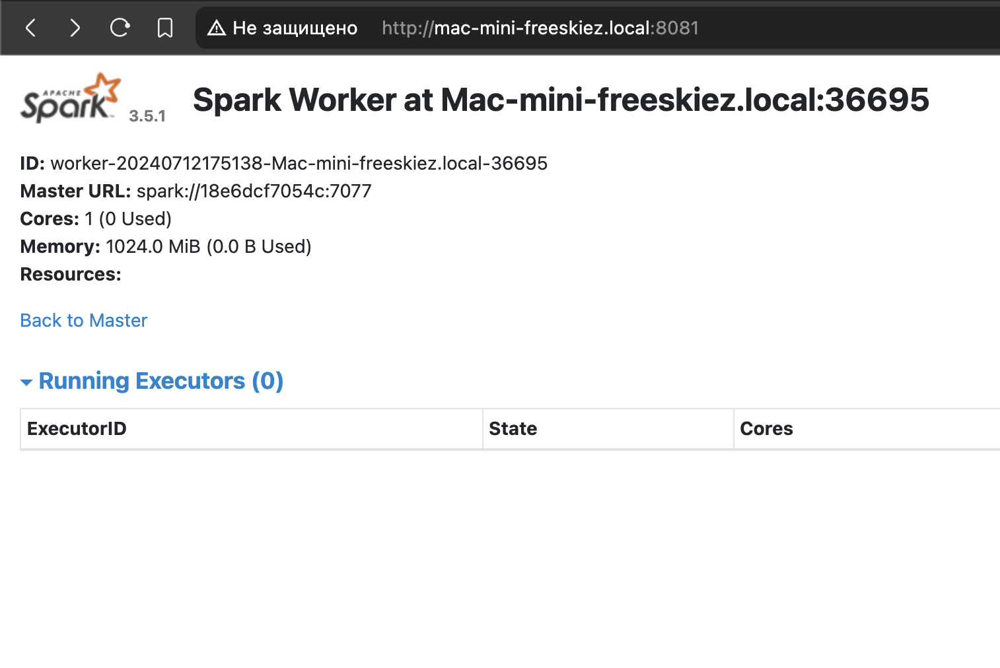
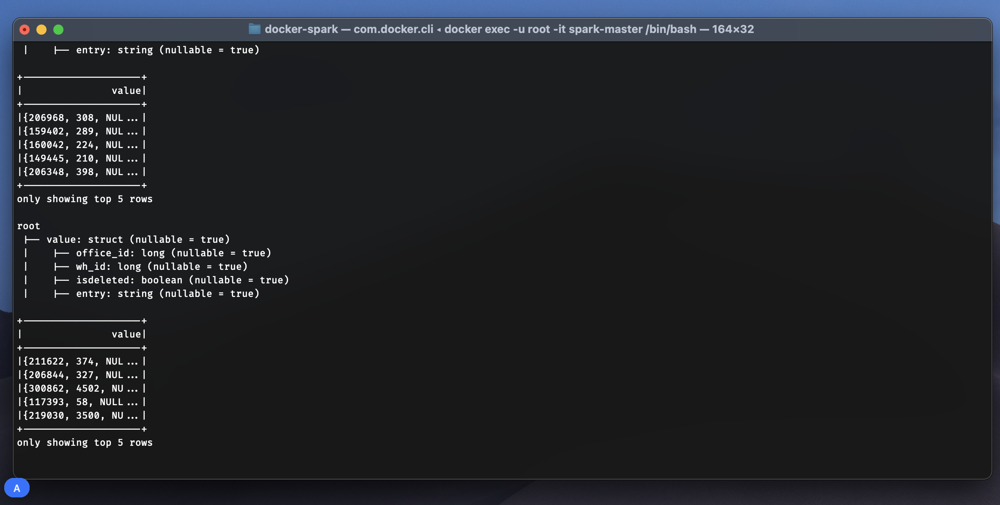
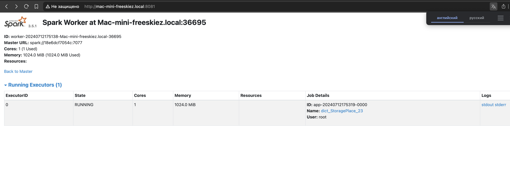
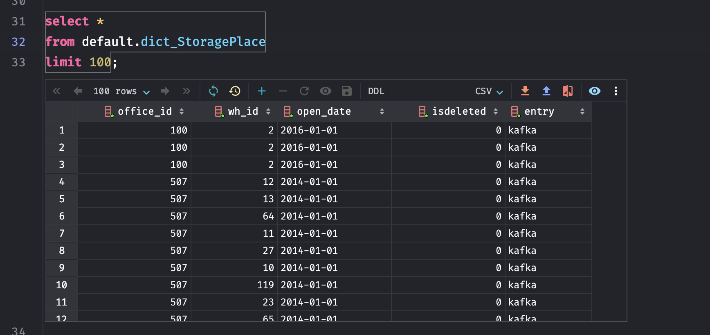

# ДЗ spark

## 1. Поднимаем все необходимые контейнеры в Docker

## 2. Подгружаем данные из Pegas в локальную Kafka

## 3. Проверяем. Мы загрузили справочник офисов и их блоков

## 4. Создаем пустые таблицы на локальном клике

## 5. Будем обогащаться open_date для каждого офиса, предварительно скачиваем csv из Pegas и загружаем в свой локальный клик

## 6. Проверяем работоспособность Spark

## 7. Читаем данные из Kafka и записываем в клик с обогащением полем open_date

Используем команду:

spark-submit --master spark://spark-master:7077  \
    --packages org.apache.spark:spark-sql-kafka-0-10_2.12:3.5.0 \
    --executor-cores 1 \
    --conf spark.driver.extraJavaOptions="-Divy.cache.dir=/tmp -Divy.home=/tmp" \
    /opt/spark/Streams/dict_StoragePlace_edu_23/dict_StoragePlace.py

## 8. Проверяем работающий процесс Spark

## 9. Проверяем итоговую таблицу

